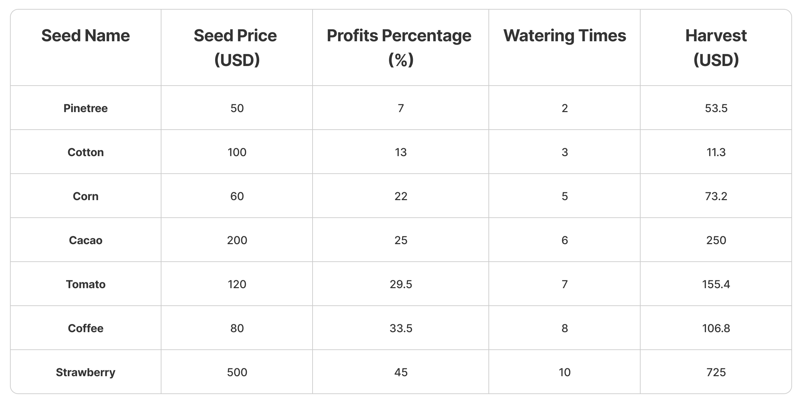

# 🏵️ MiexsFarm Rules

With the ORACLE system, players are guaranteed a profit from each type of tree they choose to buy and farm. The tokens will be balanced to the rate of USD when players buy the seeds and harvest. So players only need to care about the seed price in the shop and the seed's profit rate. No need to care about the price of the tokens.

## **1.** Variability in Plant Output Based on Seed Type

The information about the price and profit percentage of seeds after harvest is calculated according to the following table:

<figure><figcaption></figcaption></figure>

* You need to buy seeds before you start planting, and each seed has a different price. \
  There will be different growth rates and yields. The values produced by plants will vary based on the type of seed that is used.
* Tree termites will have 3 growth levels. During the growth process, you need to water the plant for at least every 2 hours.
* **After harvesting**, the received tokens will automatically be added directly to your in-game wallet player.
* When harvested, the amount of tokens obtained will be balanced according to the USD exchange rate at the time of harvest. Players will receive tokens corresponding to the conversion rate.

## 2. Deposit

* Depositing in-game tokens will incur a 2.5% transaction fee.

## 3. Withdraw

* Withdrawal of in-game tokens will incur a 2.5% transaction fee.
* The minimum withdrawal amount is $10/time. No maximum limit.
* The first withdrawal will be allowed after 24 hours from the first time login. The next time will be 1 hour after the previous withdrawal.
* Once the game pool is over, the growing season will end. Please wait for the next crop to continue farming.
* 90% of fees are used for buybacks and burns to support the token price. 10% for distribution group development and marketing activities.

