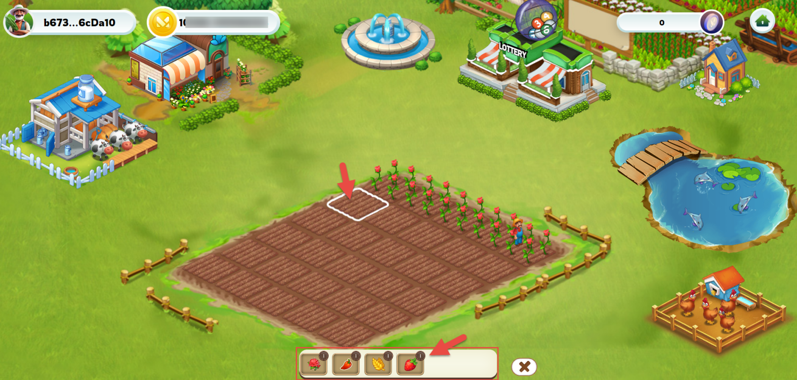

---
layout:
  title:
    visible: true
  description:
    visible: false
  tableOfContents:
    visible: true
  outline:
    visible: true
  pagination:
    visible: true
---

# 🪴 Farm

## 1. Sow seeds

Each player will be provided with 30 empty land plots for planting. After purchasing seeds from the shop, players can start planting on these plots.

<figure><figcaption></figcaption></figure>

**To start planting:**&#x20;

* The player needs to click on an empty plot of land, and a table of available seeds in the warehouse will be displayed

<figure><figcaption></figcaption></figure>

* Continue, to choose the type of seed you want to plant. Each type of plant may require different growing conditions. So the planting was successful.

<mark style="color:red;">**Attention:**</mark> If the player chooses to destroy a planted tree, it will be permanently removed from their inventory or farm. Consequently, the player will not receive any seeds or refunds for the destroyed tree.

## **2. Taking care of plants**

* Each plant will go through three stages of maturity before it can be harvested.&#x20;
* Players will need to cultivate and water the plants during each of these stages to ensure the plants grow as well as possible.

**Cultivation and watering:**

<figure><figcaption></figcaption></figure>

* Players will need to cultivate and water the plants three times within the specified time frame for each stage.
* The time between cultivation and watering can be determined based on the type of plant and growing conditions.

**Buy compostable items:**

* Players can purchase fertilizer items from the in-game store.
* Using fertilizer can help increase yields and reduce the time needed for plants to mature

When using fertilizer, the plant's growth time will be shortened from 3 stages to 2 stages. Each time a farmer uses fertilizer, the plant will increase its maturity level by 1 stage.

Ensuring a 100% harvest yield when farmers fertilize their plants twice or water them three times within the specified time frame.

## 3. Harvest

<figure><figcaption></figcaption></figure>

Once the plant has matured, farmers can harvest to receive the corresponding products.

* Harvest yield may vary depending on the quality of the seeds and the plant care process.
* After harvesting, the plant will wither, and farmers will need to purchase new seeds for replanting. The planting process is a continuous cycle, and farmers will have to prepare new seeds after each harvest to continue the process of caring for and planting new crops.

