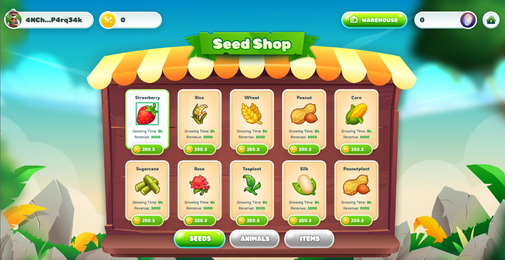

---
layout:
  title:
    visible: true
  description:
    visible: false
  tableOfContents:
    visible: true
  outline:
    visible: true
  pagination:
    visible: true
---

# 🛒 Shop

The Shop is where player can purchase seeds and access detailed information about each type of seed available, as well as other in-game items.

* Users can access the Shop from the main menu of the game.

## 1. Seeds

<figure><figcaption></figcaption></figure>

* In the Seeds section, Players can buy many types of seeds
* Each seed will have a different price, growth time, and yield and a brief description of its characteristics and benefits.
* Users can select the seeds they want to buy and proceed to checkout.

## 2. Animals (Coming Soon)

<figure><figcaption></figcaption></figure>

## 3. Items&#x20;

<figure><figcaption></figcaption></figure>

