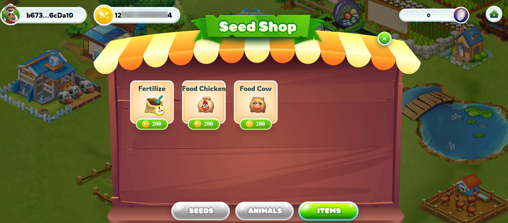

---
layout:
  title:
    visible: true
  description:
    visible: false
  tableOfContents:
    visible: true
  outline:
    visible: true
  pagination:
    visible: true
---

# 🛒 Shop

The Shop is where player can purchase seeds and access detailed information about each type of seed available, as well as other in-game items.

* Users can access the Shop from the main menu of the game.

## 1. Seeds

<figure><figcaption>
Shop in a game
</figcaption></figure>

<figure><figcaption></figcaption></figure>

* In the Seeds section, Players can buy many types of seeds
* Each seed will have a different price, growth time, and yield and a brief description of its characteristics and benefits.
* Users can select the seeds they want to buy and proceed to checkout.

## 2. Animals (Coming Soon)

* Shop animals can be part of the game's business system, allowing players to purchase animals using in-game currency.
* Shop Animals can provide players with animals or pets to raise in the game.

<figure><figcaption>
Shop animals
</figcaption></figure>

## 3. Items&#x20;

Shop items provide players with items that can be used in the game, including fertilizer, animal food and more.

<figure><figcaption>
Shop items
</figcaption></figure>

* **Fertilizer** is used to stimulate the growth and development of crops. This helps provide the necessary nutrients and compounds for plants to grow vigorously and yield well.
* **Food for chickens and food for cows** are used to nourish and care for chickens and cows. This may be related to livestock farming in the game, where players can raise and care for these livestock species to obtain products from them, such as eggs from chickens or milk from cows.

