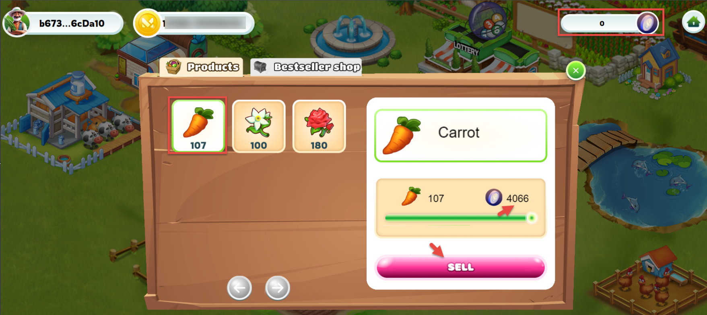
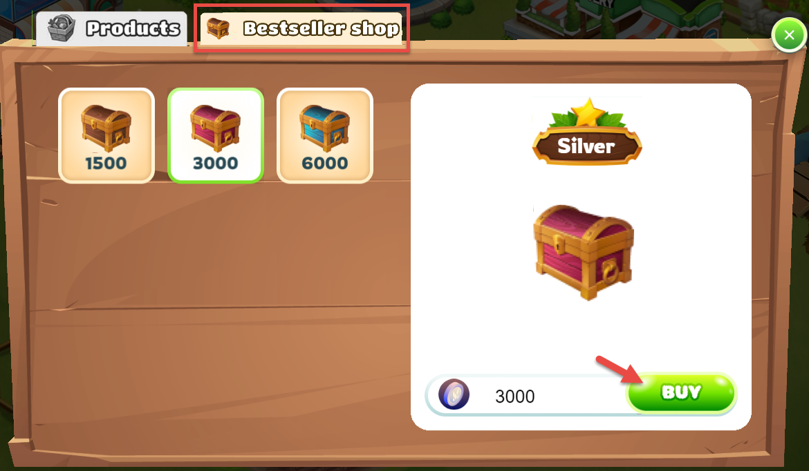
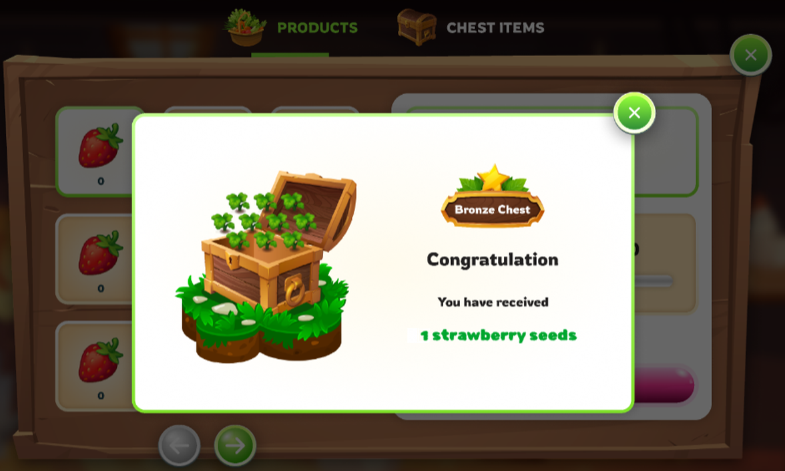

---
layout:
  title:
    visible: true
  description:
    visible: false
  tableOfContents:
    visible: true
  outline:
    visible: true
  pagination:
    visible: true
---

# 🎁 Treasure Chest

## 1. Products

\
**Harvesting and Products:**

* Players will obtain products from planting in the game when harvesting.
* These products are expected to be stored in the player's inventory.

**Products and FGT:**&#x20;

* Farmers can utilize the products to sell from their warehouses.&#x20;
* They will receive a corresponding amount of FGT (in-game currency) upon selling the products.&#x20;
* FGT can then be used to purchase chests within the game.

<figure><figcaption></figcaption></figure>

## 2. Bestseller Shop

After completing the sale of products to receive FGT, players will use FGT to open treasure chests, each chest will provide a different reward. Users will receive a random reward

* There are 3 treasure chests in total. IncIncluding Bronze - Silver - Golden &#x20;

The first treasure chest has 1-3 level seeds. The probability is 60% for level 1, 30% for level 2, and 10% for level 3.

<figure><figcaption>
Treasure Chests
</figcaption></figure>

For example, if you open a chest of Bronze containing 1500 tokens,

* 60% of the time, You will lose 10 tokens for the rose, Rose Harvest 290
* At 40%, +20 tokens to Jasmine, Jasmine Harvest 320
* In 10% of cases, + 50 tokens to the carrot. Carrot Harvest 350

<figure><figcaption>
Rewards for opening chests
</figcaption></figure>

❌ <mark style="color:red;">**The rate to receive rewards and the number of bonus items in the ball can be changed according to customer requests.**</mark>

