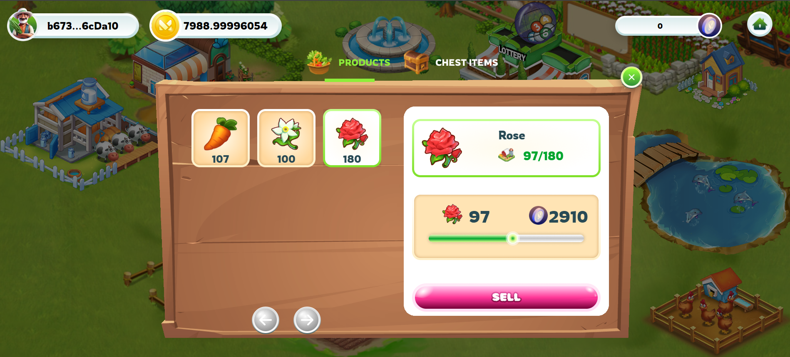

---
layout:
  title:
    visible: true
  description:
    visible: false
  tableOfContents:
    visible: true
  outline:
    visible: true
  pagination:
    visible: true
---

# 🎁 Treasure Chest

### 1. Products 

**Harvesting and Products:**

* Players will obtain products from planting in the game when harvesting.
* These products are expected to be stored in the player's inventory.

**Products and FGT:**

* Farmers can utilize the products to sell from their warehouses.
* They will receive a corresponding amount of FGT (in-game currency) upon selling the products.
* FGT can then be used to purchase chests within the game.

<figure><figcaption></figcaption></figure>

### 2. Bestseller Shop 

After completing the sale of products to receive FGT, players will use FGT to open treasure chests, each chest will provide a different reward. Users will receive a random reward

* There are 4 treasure chests in total. IncIncluding Bronze - Silver - Golden - Diamond

<figure><figcaption>
Treasure Chests
</figcaption></figure>

For example, if you open a chest of Bronze containing 3000 tokens,

* 3000 FGT Bronze CHESTS.SEEDS ( ROSE 90%, jasmine 80% carrot 70% , tomato 60%,potato 40 %)   BMH tokens (295-350) chance 10%.
* 5000 FGT Silver CHESTS( STRAWBERRY 90%, RICE80% ,WHEAT 70% PEANU T60% CORN 40%  )  BMH tokens (515-560) chance 10%.
* 7000  FGT  Golden CHESTS (COTTON 90%  SUGARCANE 80% SILK 70% TEAPLANT 60% PEPPER 40% ) BMH tokens (750-810) chance 10%.
* 9000  FGT Diamond CHESTS ( RUBBER 90% COFFEE 80% CACAO 70% PINETREE 60% ) BMH tokens (950-1050 ) chance 10%.

<figure><figcaption>
Rewards for opening chests
</figcaption></figure>

❌ <mark style="color:red;">**The rate to receive rewards and the number of bonus items can be changed according to customer requests.**</mark>
