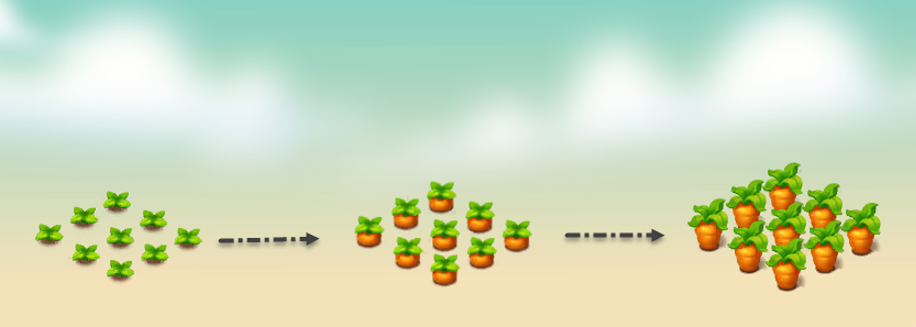

# 🥕 Carrot

<figure><figcaption></figcaption></figure>

* **Economy values:** Medium
* **Growing period:** Growing time: Carrots have a short growing time of about 6 hours, need to be watered 3 times according to the prescribed time frame to be able to harvest.
* **Origin:** The carrot, scientifically known as Daucus carota, is a popular root crop around the world originating from the Mediterranean region.
