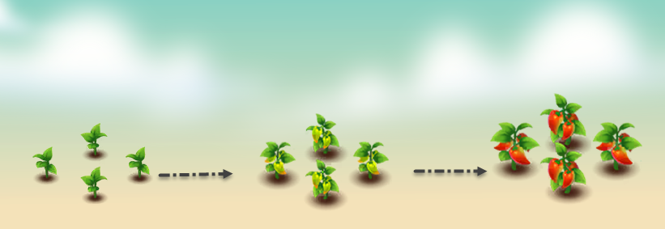

# 🌶️ Pepper

<figure><figcaption></figcaption></figure>

* **Economy values:** Medium-high
* **Growing period:** Pepper trees have a short growth period 18 hours and only need to be watered 3 times after harvesting.
* **Origin:** Chili peppers, also known simply as chillies or hot peppers, have their origins in the Americas, particularly in regions of Central and South America. They have been cultivated for thousands of years by indigenous peoples and later introduced to other parts of the world by explorers and traders. Chilli peppers are now widely grown and enjoyed in many cuisines around the globe for their spicy flavour and versatility in cooking
