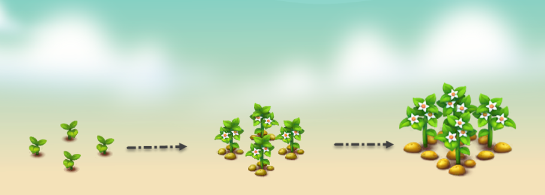

# 🥔 Potato

<figure><figcaption></figcaption></figure>

* **Economy values:** Medium
* **Growing period:** Potatoes have a not too long growth period, taking about 8 hours for the plant to mature. It's crucial to water them at specified intervals to achieve maximum yield.
* **Origin:** Potato plants, originating from the Andes mountains of South America, are a staple crop worldwide. With their versatile uses in various cuisines and high nutritional value, potatoes have become essential in global agriculture. In the farm game, growing potato plants not only provides a valuable food source but also offers players a rewarding experience in cultivation and harvest
