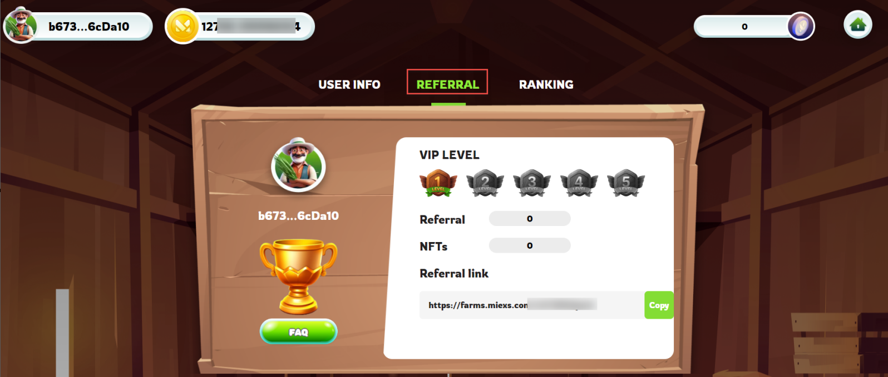
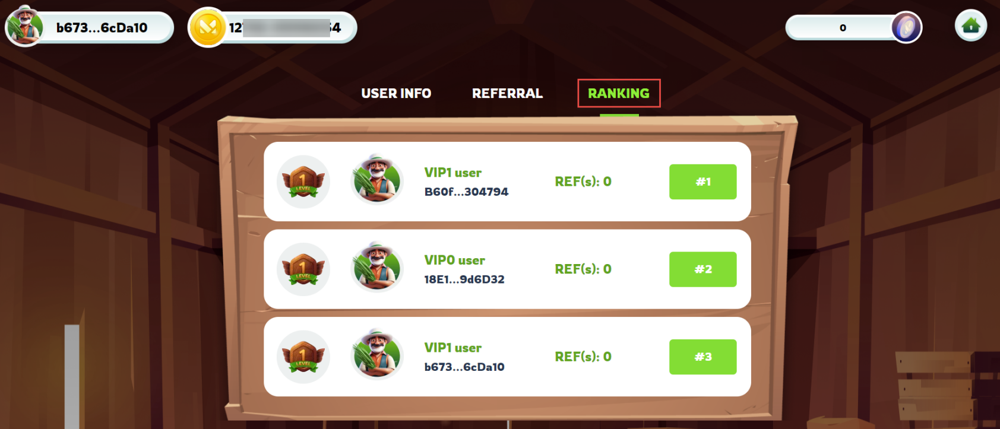

# 🧮 Honors List

Here's how it could work:

<figure><figcaption>
Referral
</figcaption></figure>

1. **Referral Program Participation:**
   * Players can participate in the referral program by inviting new players to join the game using their unique referral link.
   * Each player will have their own referral link that they can share with friends, family, or on social media platforms.

<figure><figcaption>
Ranking board
</figcaption></figure>

2. **Referral Leaderboard:**

* The game keeps track of the number of successful referrals made by each player.
* There is a leaderboard that displays the top players with the highest number of referrals on the entire server.

3. **Honors List:**

* Every week, the top 3 players with the highest number of referrals on the server are recognized and honored on the Honors List.
* This list may be displayed prominently within the game or on the game's website.

4. **Weekly Rewards:**

* The top 3 players on the referral leaderboard receive rewards in the form of tokens.
* The number of tokens awarded to each player is determined by their rank on the leaderboard. For example:
  * 1st place: X tokens
  * 2nd place: Y tokens
  * 3rd place: Z tokens
* The tokens can be used within the game for various purposes such as purchasing items, unlocking features, or participating in special events.
