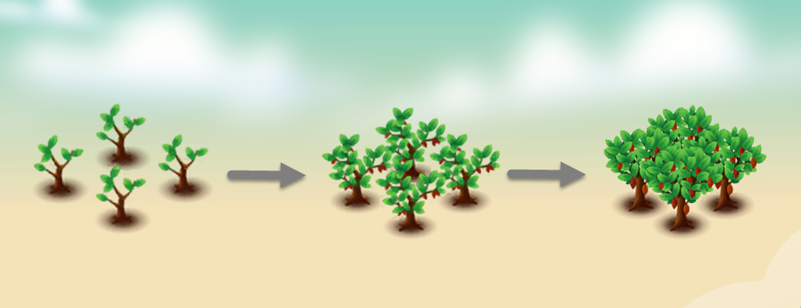

---
layout:
  title:
    visible: true
  description:
    visible: false
  tableOfContents:
    visible: true
  outline:
    visible: true
  pagination:
    visible: true
---

# 🫘 Cacao

<figure><figcaption></figcaption></figure>

* **Economy values:** Very high
* **Growing period:** Cacao trees have a short growing period compared to many other crops, taking approximately 21 hours to mature. \
  It's essential to water them 3times within the specified time frame to achieve maximum productivity.
* **Origin:** Cacao trees, also known as Theobroma cacao, have their origins in the tropical regions of Central and South America, particularly in countries like Mexico, Ecuador, and Brazil. These trees produce cacao beans, which are the primary ingredient in chocolate and various cocoa products.\
  In the game farm, cultivating cacao trees can provide players with the opportunity to grow and harvest their own chocolate-making ingredients, contributing to their farm's productivity and profitability.

<figure><figcaption></figcaption></figure>

 

<figure><figcaption></figcaption></figure>

 

<figure><figcaption></figcaption></figure>

