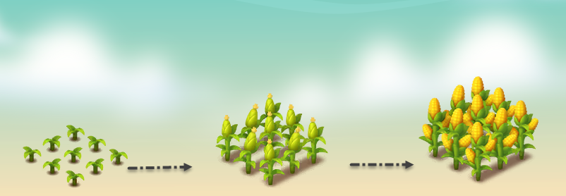

---
layout:
  title:
    visible: true
  description:
    visible: false
  tableOfContents:
    visible: true
  outline:
    visible: true
  pagination:
    visible: true
---

# 🌽 Corn

<figure><figcaption></figcaption></figure>

* **Economy values:** Medium-high
* **Growing period:** Corn has a relatively long growing period compared to many other crops, taking approximately 13 hours to mature. It's essential to water them 3times within the specified time frame to achieve maximum productivity.
* **Origin:** Corn, also known as maize, is native to the Americas, especially from regions in Mexico and Central America. Corn is one of the most widely grown cereal crops worldwide and is used as a staple food in many countries. \
  Its versatility does not stop at food as it is still used for animal feed, ethanol production, and various industrial purposes. \
  In the game's farm, players can experience the process of growing and harvesting corn, learning about the historical significance and importance of agriculture along the way.

<figure><figcaption></figcaption></figure>

 

<figure><figcaption></figcaption></figure>

 

<figure><figcaption></figcaption></figure>

