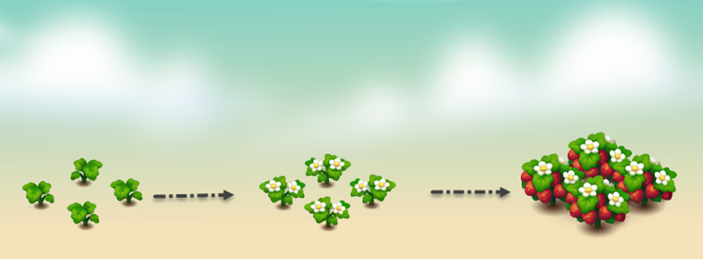

---
layout:
  title:
    visible: true
  description:
    visible: false
  tableOfContents:
    visible: true
  outline:
    visible: true
  pagination:
    visible: true
---

# 🍓 Strawberry

<figure><figcaption></figcaption></figure>

* **Economy values:** Medium
* **Growing period:** strawberries have a not-too-long growing period, typically taking around 9 hours to mature. Proper care, including regular watering and maintenance, is essential to ensure a bountiful harvest of these delicious berries.
* **Origin:** Originating from temperate regions across the globe, strawberries are a beloved fruit known for their vibrant colour, sweet taste, and aromatic fragrance.

<figure><figcaption></figcaption></figure>

 

<figure><figcaption></figcaption></figure>

 

<figure><figcaption></figcaption></figure>

