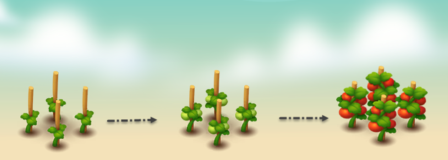

---
layout:
  title:
    visible: true
  description:
    visible: false
  tableOfContents:
    visible: true
  outline:
    visible: true
  pagination:
    visible: true
---

# 🍅 Tomato

<figure><figcaption></figcaption></figure>

* **Economy values:** Medium
* **Growing period:** Tomatoes have a not-too-long growth period, taking about 14 hours for the plant to mature. It is important to water 7 times at prescribed intervals to achieve maximum yield.
* **Origin:** The tomato originates from the tropical and temperate regions of South America. It has become an essential part of global cuisine with its distinctive flavour and high nutritional value. In the farm game, growing tomato plants is not only a great way to generate income but also provides satisfaction in caring for and harvesting fresh, delicious tomato

<figure><figcaption></figcaption></figure>

 

<figure><figcaption></figcaption></figure>

 

<figure><figcaption></figcaption></figure>

